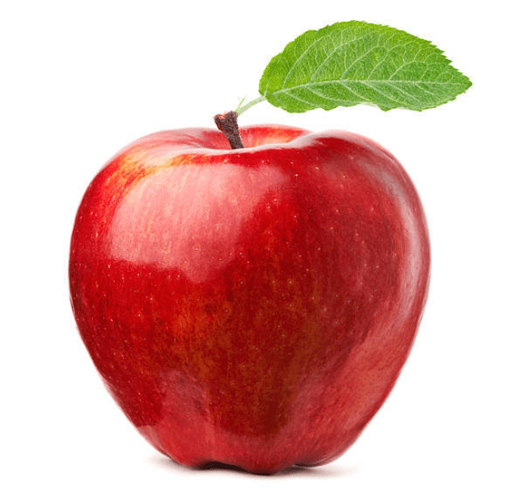

# Image

!!! note
    This requires `Pillow` dependency. You can install all necessary dependencies via
    ```python 
    pip install "docarray[image]"
    ```

DocArray offers several Image specific types to represent your image data from [`ImageUrl`][docarray.typing.url.ImageUrl] to [`ImageBytes`][docarray.typing.bytes.ImageBytes] to [`ImageNdArray`][docarray.typing.tensor.image.image_ndarray.ImageNdArray].

<figure markdown>
  { width="220" }
</figure>

## Load data
You can load image data by specifying your local or remote url as an [`ImageUrl`][docarray.typing.url.ImageUrl] 
and then call [`.load()`][docarray.typing.url.ImageUrl.load] on it. By default, [`ImageUrl.load()`][docarray.typing.url.ImageUrl.load] returns an instance of [`ImageNdArray`][docarray.typing.tensor.image.image_ndarray.ImageNdArray].

```python hl_lines="11"
from docarray.typing import ImageTensor, ImageUrl
from docarray import BaseDoc


class MyImage(BaseDoc):
    url: ImageUrl
    tensor: ImageTensor = None


img = MyImage(url='apple.png')
img.tensor = img.url.load()

print(img.tensor.__class__.__name__)
```
```text
ImageNdArray
```

## ImageTensor
DocArray offers several ImageTensors to store your data to:

1. [`ImageNdArray`][docarray.typing.tensor.image.image_ndarray.ImageNdArray]
2. [`ImageTorchTensor`][docarray.typing.tensor.image.image_torch_tensor.ImageTorchTensor]
3. [`ImageTensorFlowTensor`][docarray.typing.tensor.image.image_tensorflow_tensor.ImageTensorFlowTensor]

If you specify the type of your tensor to one of the above, it will be cast to that automatically:

```python hl_lines="7 8 12 13" 
from docarray.typing import ImageTensorFlowTensor, ImageTorchTensor, ImageUrl
from docarray import BaseDoc


class MyImage(BaseDoc):
    url: ImageUrl = None
    tf_tensor: ImageTensorFlowTensor = None
    torch_tensor: ImageTorchTensor = None


img = MyImage(url='apple.png')
img.tf_tensor = img.url.load()
img.torch_tensor = img.url.load()

print(img.tf_tensor.__class__.__name__)
print(img.torch_tensor.__class__.__name__)
```
```text
ImageTensorFlowTensor
ImageTorchTensor
```

## ImageBytes
Alternatively, you can load your [`ImageUrl`][docarray.typing.url.ImageUrl] instance to [`ImageBytes`][docarray.typing.bytes.ImageBytes], and your [`ImageBytes`][docarray.typing.bytes.ImageBytes] instance to an [`ImageTensor`][docarray.typing.tensor.image.image_tensor.ImageTensor] of your choice:

```python hl_lines="13 14"
from docarray.typing import ImageBytes, ImageTensor, ImageUrl
from docarray import BaseDoc


class MyImage(BaseDoc):
    url: ImageUrl = None
    bytes_: ImageBytes = None
    tensor: ImageTensor = None


img = MyImage(url='apple.png')

img.bytes_ = img.url.load_bytes()  # type(img.bytes_) = ImageBytes
img.tensor = img.bytes_.load()  # type(img.tensor) = ImageNdarray
```

## Display image in notebook

You can display your image data in a notebook from both an [`ImageUrl`][docarray.typing.url.ImageUrl] instance as well as an 
[`ImageNdArray`][docarray.typing.tensor.image.image_ndarray.ImageNdArray] instance.


<figure markdown>
  { width="900" }
</figure>


## Get started: Predefined ImageDoc

To get started and play around with the image modality we provide a predefined ImageDoc, which includes all of the previously mentioned functionalities:

```python
class ImageDoc(BaseDoc):
    url: Optional[ImageUrl]
    tensor: Optional[ImageTensor]
    embedding: Optional[AnyEmbedding]
    bytes_: Optional[ImageBytes]
```

You can use this class directly or extend it to your preference:
```python
from docarray.documents import ImageDoc
from docarray.typing import AnyEmbedding
from typing import Optional


# extending ImageDoc
class MyImage(ImageDoc):
    image_title: str
    second_embedding: Optional[AnyEmbedding]


image = MyImage(image_title='My first image', url='http://www.jina.ai/image.jpg')
image.tensor = image.url.load()
model = MyEmbeddingModel()
image.embedding = model(image.tensor)
image.second_embedding = model(image.tensor)
```
