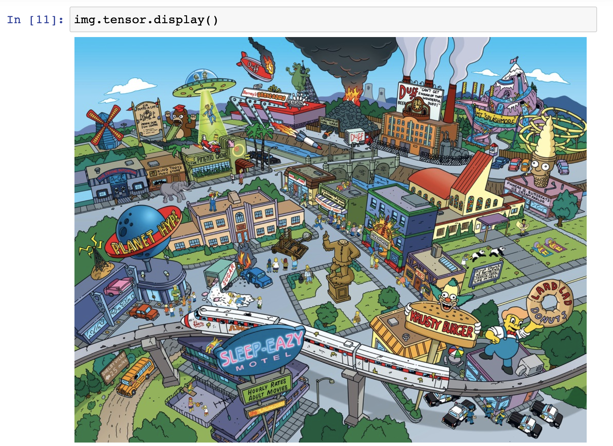

# 🖼️ Image

DocArray supports many different modalities including the widely used `Image` modality.
This section will show you how to load and handle image data using DocArray.

Moreover, we will introduce DocArray's image-specific types, to represent your image data ranging from [`ImageUrl`][docarray.typing.url.ImageUrl] to [`ImageBytes`][docarray.typing.bytes.ImageBytes] and [`ImageNdArray`][docarray.typing.tensor.image.image_ndarray.ImageNdArray].

!!! note
    This requires `Pillow` dependency. You can install all necessary dependencies via:

    ```cmd 
    pip install "docarray[image]"
    ```

## Load image

!!! tip
    Check out our predefined [`ImageDoc`](#getting-started-predefined-imagedoc) to get started and play around with our image features.

First, let's define the class `MyImage`, which extends [`BaseDoc`][docarray.base_doc.doc.BaseDoc] and has a `url` attribute of type [`ImageUrl`][docarray.typing.url.ImageUrl], as well as an optional `tensor` attribute of type [`ImageTensor`](../../../../api_references/typing/tensor/image).

Next, let's instantiate a `MyImage` object with a local or remote URL:

```python
from docarray.typing import ImageTensor, ImageUrl
from docarray import BaseDoc


class MyImage(BaseDoc):
    url: ImageUrl
    tensor: ImageTensor = None


img = MyImage(
    url='https://github.com/docarray/docarray/blob/main/tests/toydata/image-data/apple.png?raw=true'
)
```

To load the image data you can call [`.load()`][docarray.typing.url.ImageUrl.load] on the `url` attribute. By default, [`ImageUrl.load()`][docarray.typing.url.ImageUrl.load] returns an [`ImageNdArray`][docarray.typing.tensor.image.image_ndarray.ImageNdArray] object:

```python
from docarray.typing import ImageNdArray

img.tensor = img.url.load()

assert isinstance(img.tensor, ImageNdArray)
```

## ImageTensor

DocArray offers several [`ImageTensor`s](../../../../api_references/typing/tensor/image) to store your data to:

- [`ImageNdArray`][docarray.typing.ImageNdArray]
- [`ImageTorchTensor`][docarray.typing.ImageTorchTensor]
- [`ImageTensorFlowTensor`][docarray.typing.ImageTensorFlowTensor]

If you specify the type of your tensor to one of the above, it will be cast to that automatically:

```python hl_lines="7 8 12 13" 
from docarray.typing import ImageTensorFlowTensor, ImageTorchTensor, ImageUrl
from docarray import BaseDoc


class MyImage(BaseDoc):
    url: ImageUrl = None
    tf_tensor: ImageTensorFlowTensor = None
    torch_tensor: ImageTorchTensor = None


img = MyImage(url='https://github.com/docarray/docarray/blob/main/tests/toydata/image-data/apple.png?raw=true')
img.tf_tensor = img.url.load()
img.torch_tensor = img.url.load()

assert isinstance(img.tf_tensor, ImageTensorFlowTensor)
assert isinstance(img.torch_tensor, ImageTorchTensor)
```

You can also load the URL content as a [`PIL.Image.Image`](https://pillow.readthedocs.io/en/stable/reference/Image.html#PIL.Image.Image) instance using [`ImageUrl.load_pil()`][docarray.typing.url.ImageUrl.load_pil]:

```python
from PIL.Image import Image as PILImage

img = MyImage(
    url='https://github.com/docarray/docarray/blob/main/tests/toydata/image-data/apple.png?raw=true'
)
pil_img = img.url.load_pil()

assert isinstance(pil_img, PILImage)
```

## Parameterized ImageTensor

Like all of our tensors, the [`ImageTensor`s](../../../../api_references/typing/tensor/image) can be used in a parametrized way, specifying the shape of the images.
Let's say, for instance, all your images are of size `(200, 300, 3)`. 

```python
import numpy as np
from docarray import BaseDoc
from docarray.typing import ImageNdArray


class MyImage(BaseDoc):
    tensor: ImageNdArray[200, 300, 3]


img = MyImage(tensor=np.ones(shape=(200, 300, 3)))

# this would fail:
# img = MyImage(tensor=np.ones(shape=(224, 224, 3)))
```

If you have RGB images of different shapes, you can specify only the dimensions and number of channels:

```python
import numpy as np
from docarray import BaseDoc
from docarray.typing import ImageNdArray


class MyFlexibleImage(BaseDoc):
    tensor: ImageNdArray['h', 'w', 3]


img_1 = MyFlexibleImage(tensor=np.zeros(shape=(200, 300, 3)))
img_2 = MyFlexibleImage(tensor=np.ones(shape=(224, 224, 3)))
```

## ImageBytes

Alternatively, you can load your [`ImageUrl`][docarray.typing.url.ImageUrl] instance to [`ImageBytes`][docarray.typing.bytes.ImageBytes], and your [`ImageBytes`][docarray.typing.bytes.ImageBytes] instance to an [`ImageTensor`](../../../../api_references/typing/tensor/image) of your choice.

```python hl_lines="13 14"
from docarray.typing import ImageBytes, ImageTensor, ImageUrl
from docarray import BaseDoc


class MyImage(BaseDoc):
    url: ImageUrl = None
    bytes_: ImageBytes = None
    tensor: ImageTensor = None


img = MyImage(url='https://github.com/docarray/docarray/blob/main/tests/toydata/image-data/apple.png?raw=true')

img.bytes_ = img.url.load_bytes()  # type(img.bytes_) = ImageBytes
img.tensor = img.bytes_.load()  # type(img.tensor) = ImageNdarray
```
 
Vice versa, you can also transform an [`ImageTensor`](../../../../api_references/typing/tensor/image) to [`ImageBytes`][docarray.typing.bytes.ImageBytes]:

```python
from docarray.typing import ImageBytes

bytes_from_tensor = img.tensor.to_bytes()

assert isinstance(bytes_from_tensor, ImageBytes)
```

## Display image in a notebook

You can display your image in a notebook from both an [`ImageUrl`][docarray.typing.url.ImageUrl] instance as well as an 
[`ImageTensor`](../../../../api_references/typing/tensor/image) instance.

<figure markdown>
  { width="900" }
</figure>

## Getting started - Predefined `ImageDoc`

To get started and play around with the image modality, DocArray provides a predefined [`ImageDoc`][docarray.documents.image.ImageDoc], which includes all of the previously mentioned functionalities:

``` { .python }
class ImageDoc(BaseDoc):
    url: Optional[ImageUrl] = None
    tensor: Optional[ImageTensor] = None
    embedding: Optional[AnyEmbedding] = None
    bytes_: Optional[ImageBytes] = None
```

You can use this class directly or extend it to your preference:

``` { .python }
from docarray.documents import ImageDoc
from docarray.typing import AnyEmbedding
from typing import Optional


# extending ImageDoc
class MyImage(ImageDoc):
    image_title: str
    second_embedding: Optional[AnyEmbedding] = None


image = MyImage(
    image_title='My first image',
    url='http://www.jina.ai/image.jpg',
)

image.tensor = image.url.load()
model = SomeEmbeddingModel()
image.embedding = model(image.tensor)
image.second_embedding = model(image.tensor)
```
