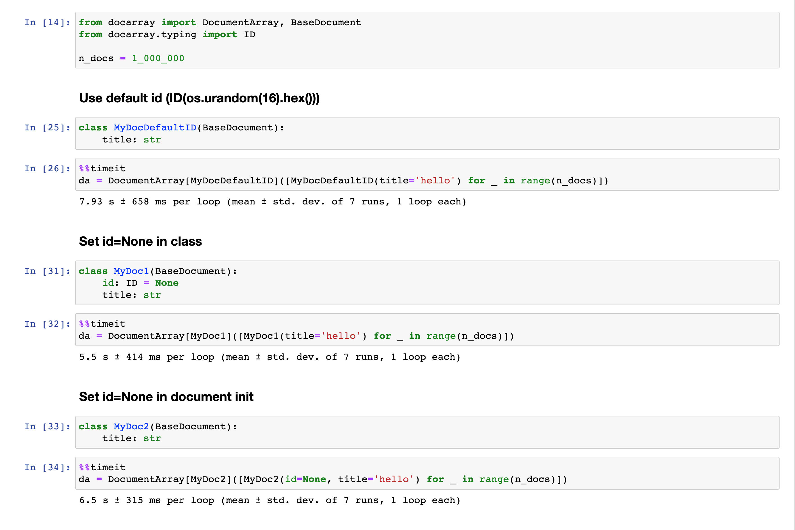

# How to optimize performance

### `BaseDocument`'s id

DocArray's `BaseDocument` has an optional `id` field, which defaults to `ID(os.urandom(16).hex())`. This takes quite some time.
If you don't rely on the id anywhere, you can instead set the default to None:

```python
from docarray import BaseDocument
from docarray.typing import ID


class MyDoc(BaseDocument):
    id: ID = None
    title: str
```

Since the `BaseDocument.id` is optional, you could also set the value to None, but this turns out to be a bit less efficient than the option above:

```python
class MyDoc2(BaseDocument):
    title: str


doc = MyDoc2(id=None, title='bye')
```

Benchmark:

