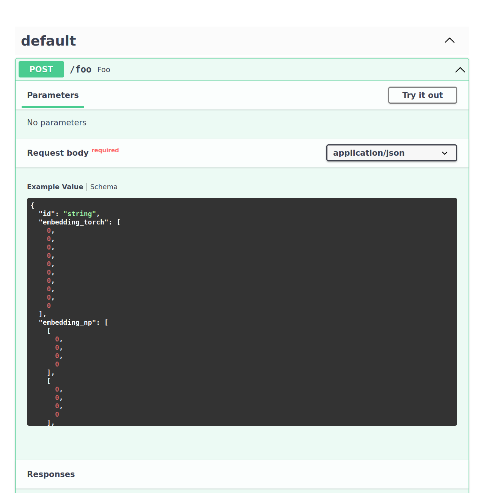
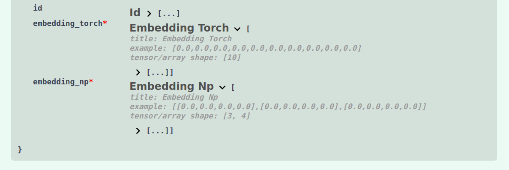

# FastAPI

[FastAPI](https://fastapi.tiangolo.com/) is a high-performance web framework for building APIs with Python based on Python type hints. It's designed to be easy to use and supports asynchronous programming. 
Since [`DocArray` documents are Pydantic Models (with a twist)](../../representing/first_step.md) they can be easily integrated with FastAPI, 
and provide a seamless and efficient way to work with multimodal data in FastAPI-powered APIs.

!!! note
    you need to install FastAPI to follow this section
    ``` 
    pip install fastapi
    ```

## Define schemas

First, you should define schemas for your input and/or output documents:
```python
from docarray import BaseDoc
from docarray.documents import ImageDoc
from docarray.typing import NdArray


class InputDoc(BaseDoc):
    img: ImageDoc


class OutputDoc(BaseDoc):
    embedding_clip: NdArray
    embedding_bert: NdArray
```

## Use documents with FastAPI

After creating your schemas, you can use your documents with FastAPI:

```python
import numpy as np
from fastapi import FastAPI
from httpx import AsyncClient

from docarray.documents import ImageDoc
from docarray.base_doc import DocArrayResponse

input_doc = InputDoc(img=ImageDoc(tensor=np.zeros((3, 224, 224))))

app = FastAPI()


@app.post("/doc/", response_model=OutputDoc, response_class=DocArrayResponse)
async def create_item(doc: InputDoc) -> OutputDoc:
    ## call my fancy model to generate the embeddings
    doc = OutputDoc(
        embedding_clip=np.zeros((100, 1)), embedding_bert=np.zeros((100, 1))
    )
    return doc


async with AsyncClient(app=app, base_url="http://test") as ac:
    response = await ac.post("/doc/", data=input_doc.json())

doc = OutputDoc.parse_raw(response.content.decode())
```

The big advantage here is **first-class support for ML centric data**, such as `TorchTensor`, `TensorFlowTensor`, `Embedding`, etc.

This includes handy features such as validating the shape of a tensor:

```python
from docarray import BaseDoc
from docarray.typing import TorchTensor
import torch


class MyDoc(BaseDoc):
    tensor: TorchTensor[3, 224, 224]


doc = MyDoc(tensor=torch.zeros(3, 224, 224))  # works
doc = MyDoc(tensor=torch.zeros(224, 224, 3))  # works by reshaping
doc = MyDoc(tensor=torch.zeros(224))  # fails validation


class Image(BaseDoc):
    tensor: TorchTensor[3, 'x', 'x']


Image(tensor=torch.zeros(3, 224, 224))  # works
Image(
    tensor=torch.zeros(3, 64, 128)
)  # fails validation because second dimension does not match third
Image(
    tensor=torch.zeros(4, 224, 224)
)  # fails validation because of the first dimension
Image(
    tensor=torch.zeros(3, 64)
)  # fails validation because it does not have enough dimensions
```


Further, you can send and receive lists of documents represented as a `DocList` object:

!!! note
    Currently, `FastAPI` receives `DocList` objects as lists, so you have to construct a DocList inside the function.
    Also, if you want to return a `DocList` object, first you have to convert it to a list. 
    (Shown in the example below)

```python
from typing import List

import numpy as np
from fastapi import FastAPI
from httpx import AsyncClient

from docarray import DocList
from docarray.base_doc import DocArrayResponse
from docarray.documents import TextDoc

# Create a docarray
docs = DocList[TextDoc]([TextDoc(text='first'), TextDoc(text='second')])

app = FastAPI()


# Always use our custom response class (needed to dump tensors)
@app.post("/doc/", response_class=DocArrayResponse)
async def create_embeddings(docs: List[TextDoc]) -> List[TextDoc]:
    # The docs FastAPI will receive will be treated as List[TextDoc]
    # so you need to cast it to DocList
    docs = DocList[TextDoc].construct(docs)

    # Embed docs
    for doc in docs:
        doc.embedding = np.zeros((3, 224, 224))

    # Return your DocList as a list
    return list(docs)


async with AsyncClient(app=app, base_url="http://test") as ac:
    response = await ac.post("/doc/", data=docs.to_json())  # sending docs as json

assert response.status_code == 200
# You can read FastAPI's response in the following way
docs = DocList[TextDoc].from_json(response.content.decode())
```

## Specify tensor shapes

DocArray enables you to serve web apps that work on tensors (from numpy, PyTorch, or TensorFlow) as input and/or output,
and lets you specify and validate the shapes of said tensors.

To do that, you have to specify the expected shape in the type hint of your document.
For example, you can create the following FastAPI app in `main.py`:

```python
from docarray import BaseDoc
from docarray.typing import TorchTensor, NdArray
from fastapi import FastAPI

from docarray.base_doc import DocArrayResponse


class Doc(BaseDoc):
    # specify shapes of tensors
    embedding_torch: TorchTensor[10]
    embedding_np: NdArray[3, 4]


app = FastAPI()


@app.post("/foo", response_model=Doc, response_class=DocArrayResponse)
async def foo(doc: Doc) -> Doc:
    return Doc(embedding=doc.embedding_np)
```

You can start the app using:
```terminal
uvicorn main:app --reload
```

This API will now only accept an `embedding_torch` of shape `(10,)` and an `embedding_np` of shape `(3, 4)`.

This is also reflected in the OpenAPI specification and SwaggerUI.
Navigate to [http://127.0.0.1:8000/docs](http://127.0.0.1:8000/docs) to see the API documentation:

=== "Example payload"

    { align=left }


=== "Schema definition"

    { align=left }

!!! note "Large tensors"
    Rendering an example payload of a large (say, 3x224x224) tensor would prohibitively slow down the API documentation.
    Therefore, only tensors with a maximum of 256 elements generate a valid payload example.

    If you specify a larget tensor (e.g. `TorchTensor[3, 224, 224]`), the example payload will show a tensor with a single
    elemnt. But data validation will stil work as expected.

